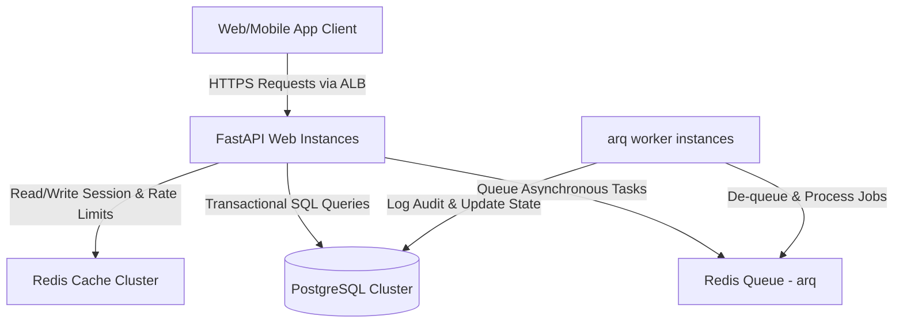
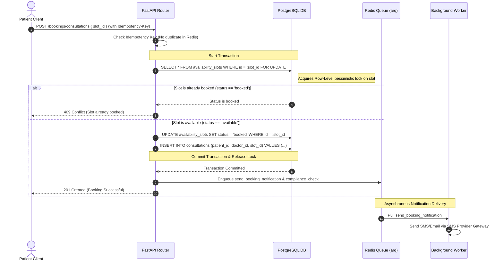
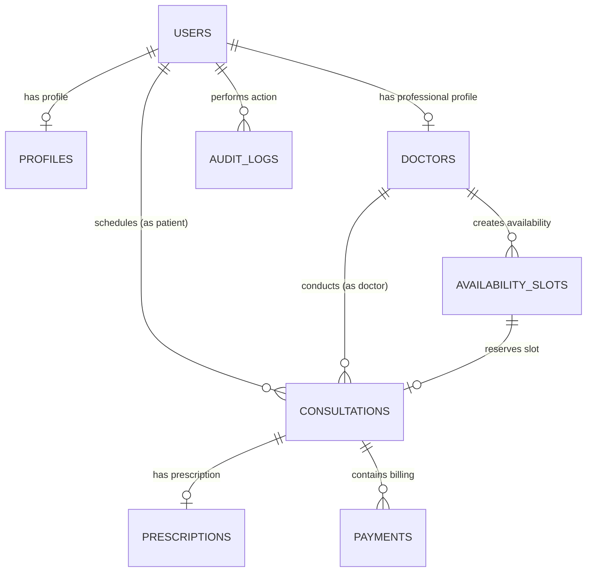

# Amrutam Telemedicine Backend Architecture Document

This document describes the high-level architecture, database schema, caching mechanisms, concurrency control, and disaster recovery strategy for Amrutam's Telemedicine System.

---

## 1. High-Level Architecture and Data Flow

The system is designed using a **Clean Layered Architecture** pattern, providing strong isolation between business logic, network interfaces, and database operations.

### Data Flow for User Workflows
1. **API Gateway / ALB**: Handles SSL termination and forwards requests to stateless FastAPI container instances scaled horizontally across multiple Availability Zones.
2. **FastAPI Middlewares**:
   - **Rate Limiter**: Blocks requests from IPs exceeding limits.
   - **Idempotency Check**: Returns cached responses for duplicate POST/PUT requests using `Idempotency-Key`.
   - **Metrics & Logging**: Injects `X-Correlation-ID` and exports latency metrics to Prometheus.
3. **Services & Repositories**: Business logic coordinates database reads/writes. Sensitive fields (PHI/PII) are encrypted at the application layer using AES-256-GCM before database operations.
4. **Background Tasks**: Heavy operations (e.g. generating PDF prescriptions, sending notifications) are pushed to the Redis `arq` queue for execution by workers.

---

## 2. Booking Flow Sequence Diagram

The sequence below illustrates the concurrency controls preventing double-booking of a doctor's availability slot:

---

## 3. Entity-Relationship (ER) Diagram

---

## 4. Concurrency, Caching & Performance Optimization

### Double Booking Prevention (Race Conditions)
We implement **Pessimistic Locking** (`SELECT FOR UPDATE`) within database transactions:
- When a consultation is booked, the `availability_slots` row corresponding to the requested time is locked exclusively.
- Any concurrent booking attempt blocks on the query. Once the first transaction commits and marks the slot as `booked`, the subsequent transaction resumes, detects the state change, rolls back, and returns a `409 Conflict`.
- Additionally, a database-level `UNIQUE` constraint is set on `consultations.slot_id` to guarantee that no two consultations can ever point to the same availability slot.

### Write Idempotency
- Heavy API writes require an `Idempotency-Key` header.
- A custom Redis middleware manages idempotency state:
  - If a key exists and is `processing`, return `409 Conflict`.
  - If a key exists and contains a cached response, return it immediately without hitting database layers.
  - If not exists, mark as `processing` in Redis with a 5-minute expire, execute the request, and cache the response payload for 24 hours.

### Caching Strategy
- **Doctor Profiles & Availabilities**: Cached in Redis with a 15-minute TTL. Slot status changes invalidate cache entries immediately.
- **Search Queries**: Query results for doctor list configurations are cached in Redis to keep p95 read latencies below 50ms.

---

## 5. Retry and Backoff Strategies

1. **Database Connections**:
   - Connection pooling handles transient connection drops using `pool_pre_ping=True` in SQLAlchemy, verifying connections before routing queries.
   - Retries with exponential backoff are configured for transient DB transaction conflicts (e.g. serialization failures).
2. **Background Worker Jobs**:
   - Jobs are configured with a max retry count of 5.
   - We utilize an exponential backoff formula for job retries: `delay = min_delay * (2 ** retry_count) + jitter`.
3. **Payment Gateways**:
   - Operations interacting with payment gateways are wrapped in **Circuit Breaker** patterns. If the gateway fails more than 5 times in 10 seconds, the breaker trips, returning a quick error without wasting system threads.

---

## 6. Scalability: Partitioning and Sharding

To sustain **100k daily consultations** with low latency, the data architecture scales out as follows:
1. **Read-Replication**:
   - Primary database instance handles write transactions (bookings, payments, prescription signatures).
   - Horizontally scalable read-replicas handle doctor search, patient dashboards, and profile reads.
2. **Database Table Partitioning**:
   - The `audit_logs` and `consultations` tables are range-partitioned monthly by their `created_at` timestamps. This keeps index sizes small, optimizes search performance, and allows dropping historic data efficiently via partition pruning.
3. **Sharding (Future Scale-out)**:
   - When database load exceeds single-instance limits, the database can be sharded horizontally based on `patient_id` or `doctor_id` hash ranges.

---

## 7. Backup and Disaster Recovery (DR) Strategy

- **Recovery Point Objective (RPO)**: 5 minutes.
- **Recovery Time Objective (RTO)**: 15 minutes.

### 1. Database Backups
- **Continuous Backups**: AWS RDS automated backups with point-in-time recovery (PITR) enabling restoration to any millisecond within the retention window (default 35 days).
- **Manual Snapshots**: Daily encrypted snapshots copied to a separate AWS region.

### 2. Multi-Region Failover (DR)
- **Active-Passive Setup**: The application runs in a primary AWS region (e.g., `us-east-1`). A secondary region (e.g., `us-west-2`) is maintained in standby mode.
- **Route 53 Routing Policy**: Active failover routing based on health checks. If the primary ALB becomes unhealthy, DNS automatically shifts traffic to the standby load balancer.
- **Cross-Region Read Replicas**: The secondary region maintains a hot standby database read replica that is promoted to master during failover.
